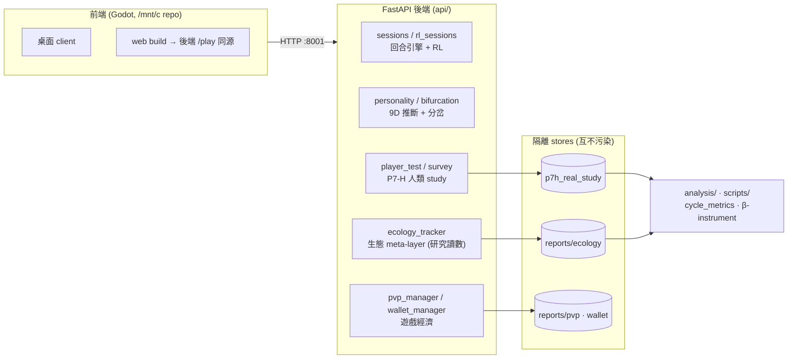
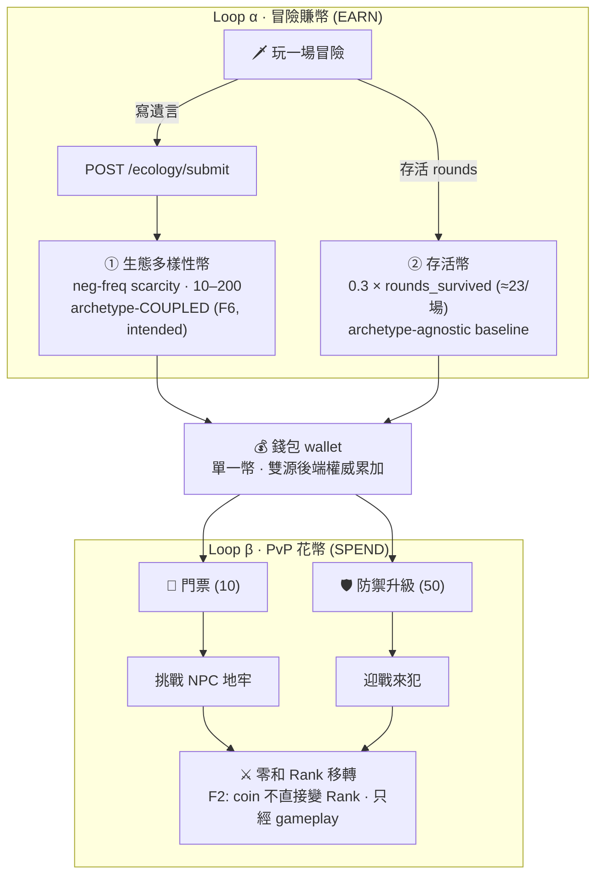

# Personality Dungeon 專案檔案結構指南

## 1. 專案核心概述

| 項目 | 說明 |
| --- | --- |
| 專案定位 | 以 Python 為主的研究型人格地下城模擬器，結合回合制事件壓力、策略演化、人格狀態更新與分析報表。 |
| 核心目標 | 產出可重現的 time series 與 CSV 結果，用於驗證循環動態、人格耦合、事件模板與多種 payoff / replicator 規則。 |
| 主要互動方式 | 目前以 CLI 執行為主，另有 FastAPI HTTP API 作為核心契約整合層。 |
| 前端狀態 | **Godot 前端**（獨立 repo [`personality-dungeon-client`](https://github.com/weiyi175/personality-dungeon-client)，本地 `/mnt/c/Users/n1166/personality-dungeon`）透過 FastAPI 與後端互動；另有 Godot **web build** 由後端 `/play` 同源服務（友人瀏覽器測試）。`architecture_overview.html`/`docs/*.html` 為說明與研究視覺化。 |

### 兩條主線（研究皇冠 vs 遊戲載具）

| 軌 | 是什麼 | 現況 |
| --- | --- | --- |
| **研究皇冠** | **多樣性動力**——生態能否維持共存（diversity）vs 塌成 monoculture；多少 directional 壓力 `g` 會翻（`g*` 預算）。`diversity 才是目標`。 | **sim-complete**：`g*(β)` 曲線（conditional on β）+ controls + ablation。**唯一開放＝真實 β**，gated 在真人收集（乙）。 |
| **遊戲載具** | 人格地下城 + 跨玩家生態 + PvP 經濟。**存在是為了吸引/留住玩家來產生行為資料**，不是目的本身。 | Inc2/3 經濟 + 雙經濟循環全通；firewall 裁定隔離乾淨。 |

> **firewall**：兩軌結構性隔離——遊戲玩法（PvP/經濟）**不可能**污染多樣性研究讀數（archetype 分佈只由「寫遺言」構成）。詳見 [`地牢經濟_R3C隔離_規劃_v1.md` §2/§10](地牢經濟_R3C隔離_規劃_v1.md)。

### 系統架構（前端 ⟷ 後端 ⟷ 隔離 stores）



### 核心經濟循環（雙循環 · single coin (ii)）

> 遊戲層是收集真人行為資料的載具：玩冒險**賺幣**（雙源）→ 玩 PvP **花幣**。單一幣（採方案 ii）。
> 完整設計與校準鉤見 [`地牢經濟_R3C隔離_規劃_v1.md` §3](地牢經濟_R3C隔離_規劃_v1.md)。



**Firewall（研究隔離）**：研究皇冠＝archetype 分佈，**只**由「寫遺言」構成。PvP loadout 零讀 will（F1）+ PvP 不餵生態 submit（F4）→ 花幣迴路**結構上碰不到**研究讀數；① 生態幣的 archetype 耦合（F6）是 intended 的「逐利→多樣性」那條合法通道。

<details><summary>ASCII 版（同圖）</summary>

```text
[Loop α 冒險賺幣]  玩冒險 ─┬─ 寫遺言 →/ecology/submit→ ① 生態多樣性幣（scarcity, archetype-COUPLED, F6, 10–200）
                          └─ 存活 rounds ──────────────→ ② 存活幣（agnostic baseline, 0.3×rounds, ≈23/場）
                                      兩源「後端權威」一次累加（單一幣 ii）↓
                                                【錢包】
[Loop β PvP 花幣]  錢包 ─┬─ 門票(10) ─┬─ 防禦升級(50) → 挑戰/迎戰 → 零和 Rank（F2：coin 不直接變 Rank）
```
</details>

### 資料 store 隔離（firewall 的落地）

| store（OUT_DIR） | 內容 | 隔離理由 | git |
| --- | --- | --- | --- |
| `p7h_real_study/` | P7-H 人類 study sessions + survey | 不污染生態/遊戲 | tracked |
| `reports/ecology/` | 生態提交 + 快照（**研究讀數**：archetype 分佈） | **只由 will-authoring 構成**（F4/F5：PvP 不餵） | tracked |
| `reports/pvp · wallet/` | 遊戲 Rank / 錢包（runtime state） | 遊戲面，與研究讀數解耦 | gitignored |

> ⚠ 真人判準是 **store-specific**：ecology 真人＝`session_id` ∧ `outcome` 非空（**非** run_id 號）。跨 store 套 run_id 會誤判（見 `研發日誌.md` 更正記錄）。

### API 表面（按領域，`api/server.py`）

| 領域 | 端點（節錄） | 用途 |
| --- | --- | --- |
| 回合引擎 | `/sessions/*`、`/rl_sessions/*`、`/event/choose` | 地下城回合 + RL 策略 |
| 9D / 分岔 | `/personality/infer[_sbert]`、`/bifurcation/*` | 人格推斷 + 分岔偵測（P7-H 機制） |
| P7-H 人類 study | `/player-test/*`、`/survey/*` | 真人 study 收集 |
| 生態 meta-layer | `/ecology/{submit,snapshot,assess,scarcity_variation}` | 跨玩家多樣性評分 + **乙 monitor** |
| 遊戲經濟 | `/pvp/{dungeons,challenge,deploy,defense/upgrade,raid}`、`/wallet[/credit]` | PvP + 雙經濟循環 |
| 指標 / web | `/metrics/events`、`/play`（Godot web build 同源服務） | 遙測 + 瀏覽器測試 |

### 研究軌狀態

| 線 | 狀態 |
| --- | --- |
| P7-H（人格分岔 HCI） | ✅ 封存（max_proximity d≈3.25、`H_counter` 證偽） |
| 生態 ECO-DP `g*(β)` | ✅ sim-complete（conditional on β；controls + ablation） |
| β-instrument + 乙（行為版收集） | ✅ instrument 建好驗好；β bound **gated 真人收集**（乙 pilot 就緒，runbook R0 ✅） |
| 經濟 α\*(κ) whiplash | ✅ sim；真實 α/σ 待行為版 |
| L3 dynamics | 🚫 SHELVED（負結果＝重新發現既有 finite-N quasi-cycle，改框方法論示範） |

### 關鍵文件地圖

| 檔 | 是什麼 |
| --- | --- |
| `SDD.md` | 唯一正式規格 |
| `研發日誌.md` | 進度日誌（末節＝最新狀態） |
| `HANDOFF_NEXT_SESSION.md` | 下個 session 接手 prompt + TODO + 反偏離檢查 |
| `地牢經濟_R3C隔離_規劃_v1.md` | 遊戲經濟 + firewall（§3 循環圖 / §10 重審） |
| `docs/experiments/ecology_directional_pressure/` | ECO-DP 結果、β-instrument、**乙 pre-reg（§8 pilot→confirm runbook）** |

## 2. 目錄結構樹

```text
personality-dungeon/
├── README.md                    # 專案總覽與快速開始
├── SDD.md                       # 唯一正式規格文件
├── requirements.txt             # 依賴清單
├── api/                         # 核心↔前端契約 API
├── analysis/                    # 純分析與回歸指標
├── config/                      # YAML 設定檔
├── core/                        # 回合引擎與策略骨架
├── dungeon/                     # payoff 與事件解析
├── docs/                        # 研究文件、規格與設計稿
│   └── personality_dungeon_v1/  # v1 design pack
├── evolution/                   # replicator / 演化更新
├── players/                     # 玩家與人格模型
├── scripts/                     # 實驗、報表、診斷腳本
├── simulation/                  # 主組裝、CLI 與 CSV 輸出
├── tests/                       # 回歸測試
├── outputs/                     # 產出資料
└── logs/                        # 執行記錄
```

根目錄下另外還有一些研究成果與摘要檔，例如 `paper_draft_v2.md`、`Phase1_21_總結.md`、`architecture_overview.html`、`b1_async_*.json`，這些通常屬於研究輸出，不是 runtime 核心。

## 3. 關鍵資料夾與檔案說明

### Core / Logic

| 路徑 | 用途 | 備註 |
| --- | --- | --- |
| `simulation/run_simulation.py` | 主入口 CLI，負責組裝 `GameEngine`、`DungeonAI`、`EventLoader`、`BasePlayer` 與演化更新，最後輸出 CSV。 | 可視為本 repo 的 `main.py` 等價入口。 |
| `core/game_engine.py` | 每回合主迴圈，讓玩家選策略、取得 reward、更新 popularity。 | 只負責流程，不做 I/O。 |
| `dungeon/dungeon_ai.py` | 核心 payoff 模組，支援 `count_cycle`、`matrix_ab`、`threshold_ab`，並可接事件 loader。 | 是地牢規則與 reward 計算的核心。 |
| `dungeon/event_loader.py` | 載入事件模板 JSON、驗證 schema、處理事件回合結果。 | 對應 `docs/personality_dungeon_v1/02_event_templates_v1.json`。 |
| `evolution/replicator_dynamics.py` | replicator、async、inertial、subgroup 等權重更新規則。 | 純計算，不做 I/O。 |
| `players/base_player.py` | 玩家抽樣、策略權重、人格與狀態容器。 | 負責「玩家如何做選擇」的共通介面。 |
| `simulation/personality_coupling.py` | personality signal 與 dynamics 參數的耦合橋接。 | 用於人格驅動的更新規則。 |
| `simulation/seed_stability.py` | 多 seed 穩健性報表 CLI。 | 用來看 cycle_level 與 envelope decay 分佈。 |
| `analysis/cycle_metrics.py`、`analysis/decay_rate.py`、`analysis/jacobian_rotation.py` | 純分析與指標計算。 | 只讀 CSV 或純函式輸入，不應反向依賴 `simulation/`。 |

### Frontend / UI

| 路徑 | 用途 | 備註 |
| --- | --- | --- |
| `api/server.py` | FastAPI 伺服器，提供 session、step、snapshot、reset 等 HTTP 端點。 | 這是目前最接近「前端整合層」的介面。 |
| `api/schemas.py` | API 的 request / response schema。 | 維持核心↔前端契約一致。 |
| `architecture_overview.html` | 架構總覽頁。 | 偏文件與可視化，不是遊戲前端。 |
| `docs/*.html` | 研究藍圖、報告與說明頁。 | 多為閱讀用途。 |

目前沒有獨立的 Godot、Unity、Web App 或 React 前端工程；如果之後要補 UI，應先對齊 `api/` 的契約，再往上層做畫面。

### Configuration / Data

| 路徑 | 用途 | 備註 |
| --- | --- | --- |
| `config/game_config.yaml` | 遊戲與回合基本參數。 | 屬於執行設定。 |
| `config/evolution_config.yaml` | 演化相關參數。 | 與 replicator / update 行為相關。 |
| `config/risk_config.yaml` | 風險與門檻設定。 | 常與事件或人格風險模型搭配。 |
| `docs/personality_dungeon_v1/README.md` | v1 design pack 索引。 | 這是人格地下城規格與實作順序的導覽。 |
| `docs/personality_dungeon_v1/01_personality_dimensions_v1.json` | 12D personality vector 規格。 | 人格維度的正式資料契約。 |
| `docs/personality_dungeon_v1/02_event_templates_v1.json` | 事件模板、風險模型、成功模型、state effects。 | 事件系統的核心資料。 |
| `docs/personality_dungeon_v1/03_personality_projection_v1.py` | 12D 到 3-strategy simplex 的投影工具。 | 規格與實作之間的橋接。 |
| `docs/personality_dungeon_v1/04_economy_rules_v1.json` | 經濟公式與平衡約束。 | 給 orchestration / service layer 用。 |
| `docs/personality_dungeon_v1/05_little_dragon_v1.py` | 自適應地下城壓力引擎。 | World-pressure / meta GAI 的第一版。 |
| `outputs/` | 模擬輸出、CSV、summary JSON、圖表。 | 研究結果的主要落點。 |
| `logs/` | 執行紀錄。 | 用於追查實驗流程與回歸問題。 |

## 4. 模組依賴關係

| 流程 | 主要依賴 | 說明 |
| --- | --- | --- |
| `simulation/run_simulation.py` | `core/game_engine.py`、`dungeon/dungeon_ai.py`、`dungeon/event_loader.py`、`players/base_player.py`、`evolution/replicator_dynamics.py` | 先組裝回合引擎，再寫出 timeseries CSV。 |
| `core/game_engine.py` | `players` + `dungeon` | 每回合由玩家選策略，地牢給 reward，再回寫 popularity。 |
| `dungeon/dungeon_ai.py` | 事件模板 JSON、上一輪 popularity、可選 event loader | 負責 payoff 與事件結果的合成。 |
| `evolution/replicator_dynamics.py` | 玩家 last_reward、策略權重 | 將觀測到的 reward 轉成下一輪權重。 |
| `analysis/*` | `simulation` 產出的 CSV 或純函式輸入 | 計算 cycle_level、decay_rate、Hopf/rotation 等指標。 |
| `api/server.py` | `core/game_engine.py`、`api/schemas.py` | 提供 HTTP session API，做核心與外部整合。 |

依 SDD 規範，`analysis/` 不得 import `simulation/`，`evolution/` 不做 I/O，而 `simulation/` 才是組裝與 CSV 契約的唯一層。

## 5. 開發與環境指引

### 入口檔案

| 入口 | 用途 | 建議用途 |
| --- | --- | --- |
| `simulation/run_simulation.py` | 主模擬入口。 | 先用它跑最小可重現樣本。 |
| `simulation/seed_stability.py` | 多 seed 穩健性報告。 | 驗證不同 seed 的分佈是否穩定。 |
| `api/server.py` | HTTP API 入口。 | 需要 session / snapshot / step 時使用。 |
| `analysis/decay_rate.py` | envelope decay / growth rate 計算。 | 用於回歸與研究驗證。 |
| `analysis/hopf_scan.py`、`analysis/cycle_metrics.py` | 旋轉性與週期性分析。 | 用於理論掃描與指標回歸。 |

### 執行環境

| 項目 | 說明 |
| --- | --- |
| Python | 建議 Python 3.10+。目前 workspace 的 venv 也是 Python 3.10，且程式中已使用較新的型別語法。 |
| 基本依賴 | `pytest`、`python-pptx`，`matplotlib` 為可選繪圖依賴。 |
| API 額外依賴 | `fastapi`、`pydantic`、`uvicorn`。 |
| 執行原則 | 終端、測試與腳本請一律使用 `./venv/bin/python`，不要用系統 Python。 |

### 常用命令

| 命令 | 用途 |
| --- | --- |
| `./venv/bin/python -m simulation.run_simulation --out outputs/timeseries.csv` | 跑基線模擬並輸出 CSV。 |
| `./venv/bin/python -m simulation.run_simulation --payoff-mode matrix_ab --a 1.0 --b 1.2 --out outputs/matrix_ab.csv` | 跑 matrix payoff 版本。 |
| `./venv/bin/python -m simulation.seed_stability --payoff-mode matrix_ab --a 1.0 --b 1.2 --players 300 --rounds 3000 --selection-strength 0.02 --seeds 0:9 --series w --burn-in-frac 0.3 --tail 2000` | 做多 seed 穩健性報表。 |
| `./venv/bin/python -m api.server` | 啟動 HTTP API，預設監聽 `0.0.0.0:8000`。 |
| `./venv/bin/python -m analysis.decay_rate --csv outputs/timeseries.csv --series w` | 從 CSV 估計 envelope gamma。 |
| `./venv/bin/pytest -q` | 執行測試。 |

### 開發流程建議

| 規則 | 說明 |
| --- | --- |
| Spec first | 任何會改變 CSV 欄位、payoff 定義、演化規則或不變條件的變更，先更新 `SDD.md`，再改程式碼。 |
| 分支策略 | 建議在 `feature/` 分支上開發，完成後再發 PR。 |
| 文件順序 | 目前倉庫未看到 `docs/README_dev.md`，因此新加入的開發者可先讀 `README.md`、`SDD.md`、`docs/personality_dungeon_v1/README.md`。 |

## 6. 新人建議閱讀順序

1. `README.md`：先看專案現況與快速開始。
2. `SDD.md`：確認分層、不變條件與研究規格。
3. `docs/personality_dungeon_v1/README.md`：理解人格地下城 v1 的設計包。
4. `simulation/run_simulation.py`：看主入口如何把模組串起來。
5. `api/server.py`：若需要 HTTP 契約，再看 API 層。
