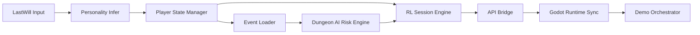

# Module Dependency Graph

## Metadata

| Field | Value |
|---|---|
| Document ID | PGM-03 |
| Owner | Architecture Lead |
| Audience | Integration Engineer, Tech Lead |
| Update Frequency | Bi-weekly |
| Dependency | module_dictionary.md |

## Cross References

- ./module_dictionary.md
- ../01_runtime_bridge/runtime_bridge_matrix.md
- ../03_technical_debt/refactor_risk.md

## Dependency Graph (High Level)

## Dependency Risk Matrix

| Upstream | Downstream | Interface | Coupling Level | Drift Risk | Change Owner | Last Review |
|---|---|---|---|---|---|---|
| Personality Infer | Player State Manager | vector payload | Medium | Medium | Backend Lead | 2026-05-27 |
| Event Loader | RL Session Engine | event candidate schema | High | High | Simulation Engineer | 2026-05-27 |
| RL Session Engine | API Bridge | session init/step contract | High | High | Integration Lead | 2026-05-27 |
| API Bridge | Godot Runtime Sync | HTTP payload | High | High | Integration Lead | 2026-05-27 |
| Godot Runtime Sync | Demo Orchestrator | playable loop state | Medium | Medium | Gameplay Lead | 2026-05-27 |

## Baseline Notes (2026-05-27)

- Highest risk edge: API Bridge -> Godot Runtime Sync。
- Highest coupling edge: RL Session Engine -> API Bridge。
- Immediate mitigation: 先凍結 session response 最小欄位集，避免 Gate 前 drift。

## 變更審查規範

1. 若 Coupling Level = High，必須同步更新 api_contract_status.md。
2. 若 Drift Risk = High，必須在 technical_debt_matrix.md 建立一筆追蹤。
3. Gate 前 48 小時不得變更 High coupling interface。

## Revision History

| Date | Author | Change |
|---|---|---|
| 2026-05-27 | Copilot | Initial dependency graph and risk matrix |
| 2026-05-27 | Copilot | Added baseline risk ownership and mitigation notes |

## Future Expansion

- 為每條邊新增測試案例連結與 owner SLA。
- 納入 CI 介面破壞掃描結果。
