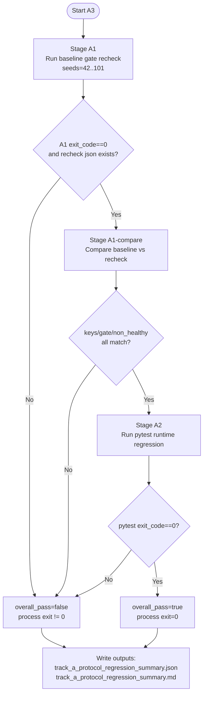

# Track A A3 Onboarding One-Pager

本頁用途：給新加入成員在 5 分鐘內理解並執行 A3 protocol regression。

## 1. A3 是什麼

A3 是 Track A 的固定回歸入口，把以下三件事鎖成單一流程：

1. A1 baseline gate 重驗
2. A1 重驗 vs baseline 一致性比對
3. A2 runtime regression 測試

契約來源：`SDD.md` 的 `Track A A3 Protocol Regression 契約（Spec Lock）`。

## 2. 何時要跑

1. 修改 `simulation/`、`tests/test_personality_rl_runtime.py`、或 A1/A2 相關流程後
2. release 前
3. 每週例行 regression

## 3. 一鍵入口

### 本地（建議）

```bash
./venv/bin/python -m simulation.track_a_protocol_regression
```

### GitHub Actions（手動觸發）

Workflow: `.github/workflows/track_a_protocol_regression.yml`

觸發方式：Actions -> `Track A Protocol Regression` -> `Run workflow`

## 4. 流程圖（Mermaid）



## 5. 三階段固定語意

| Stage | 固定動作 | 通過條件 | 失敗訊號 |
|---|---|---|---|
| A1 Gate Recheck | `simulation.pers_cal_baseline_gate60 --seeds 42..101` | exit code=0 且 recheck JSON 存在 | gate 程式錯誤、輸出檔缺失 |
| A1 Compare | 比對 baseline/recheck 的關鍵統計 + `gate.overall_pass` + `non_healthy` seeds | `mismatches={}` | 任一欄位不一致 |
| A2 Runtime Regression | `pytest -q tests/test_personality_rl_runtime.py` | pytest exit code=0 | 測試失敗 |

> 注意：流程順序不可改、Stage 不可跳過。

## 6. 輸出產物與判讀

A3 固定輸出：

1. `outputs/track_a_protocol_regression_summary.json`
2. `outputs/track_a_protocol_regression_summary.md`
3. `outputs/pers_cal_baseline_gate60_recheck_42_101_summary.json`

快速判讀順序：

1. 看 `overall_pass`
2. 看每個 stage 的 `exit_code` 與 `passed`
3. 若 A1 Compare 失敗，先看 `details.mismatches`
4. 若 A2 失敗，直接看 `details.stdout` / `details.stderr`

## 7. 常見失敗與處置

### Case A: baseline JSON 不存在

現象：A1 Compare 報 `Missing baseline summary JSON`

處置：

```bash
mkdir -p outputs
cp tests/fixtures/track_a/pers_cal_baseline_gate60_summary.json outputs/pers_cal_baseline_gate60_summary.json
```

### Case B: A1 Compare mismatch

現象：`mismatches` 非空

處置：

1. 先確認是否有動到 baseline 定義或 gate 閾值
2. 若有，必須先更新 Spec，再更新對應回歸
3. 若沒有，視為回歸異常，先停在 Track A 排查

### Case C: A2 pytest fail

現象：A2 stage `exit_code != 0`

處置：

1. 依 pytest 失敗項修正 runtime bridge 或契約測試
2. 修完後重跑 A3，直到 `overall_pass=true`

## 8. 團隊操作守則

1. A3 是 Track A 的標準入口，不用手動拆成三段跑
2. 不要在 A3 入口裡偷改 runtime 動力學與 gate 契約
3. 若要改契約，先改 `SDD.md` 再改程式與測試
4. 任何要宣告「可發布」的變更，至少附上一次 A3 PASS 摘要
